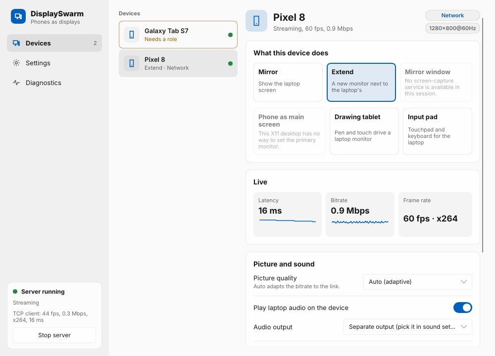
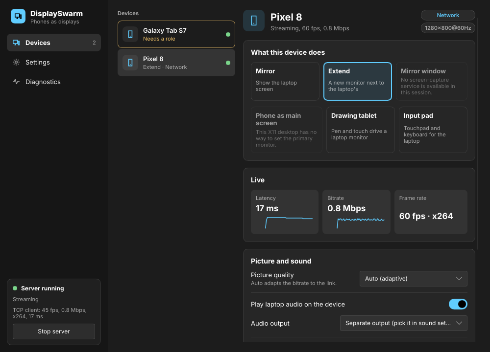
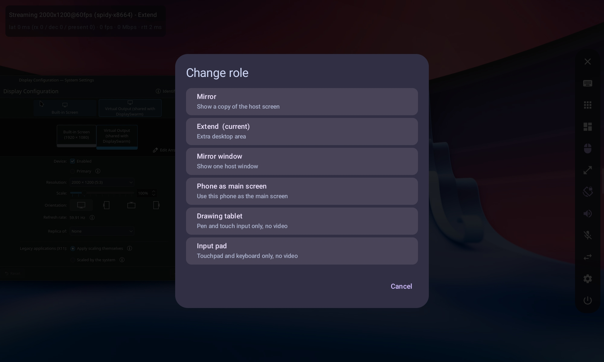

# DisplaySwarm

Use your Android phones or tablets as a second monitor/speaker for your Linux PC, over USB or Wi-Fi. Several devices can be connected at once.

[](https://github.com/ratan00/displayswarm/releases/latest)
[](https://github.com/ratan00/displayswarm/releases/latest)

*Click a badge to open the latest release, then pick the `.AppImage` or `.apk` file under Assets.*

## Features

- Low-latency H.264 video (hardware encoding via VAAPI)
- USB (Android Open Accessory, no ADB needed) or Wi-Fi with TLS and PIN pairing
- Touch, multi-touch gestures and pressure/tilt stylus input
- Extend, mirror, or use the phone as your main screen
- Laptop audio on the phone, phone microphone to the laptop, synced across devices
- Clipboard sharing and file transfer
- Phone battery on the host, per-device settings

## Works fine on

- KDE Plasma 6 (Wayland)
- GNOME (Wayland). Don't use the display-switch key (F4) while streaming; it can crash gnome-shell (a mutter bug). Change roles in the app instead.
- X11 desktops (Cinnamon, XFCE, MATE, ...)(not 100%)

## Limited support

- COSMIC: partial(mirror only)
- Windows host: written, never tested
- Sway, Hyprland and other wlroots compositors: not supported yet

Tested so far on one machine, so other GPUs and drivers may need fixes.

## Install

Download the latest packages and the Android app from the **[Releases page](https://github.com/ratan00/displayswarm/releases)**:

| Platform | File |
|---|---|
| Arch / CachyOS / Manjaro | `displayswarm-*.pkg.tar.zst` (`sudo pacman -U file`) |
| Debian / Ubuntu | `displayswarm_*_amd64.deb` (`sudo apt install ./file`) |
| Any Linux | `DisplaySwarm-*.AppImage` (`chmod +x` and run) |
| Android 8+ | `DisplaySwarm-*.apk` |

The Android app checks the Releases page when you open its Settings and tells you when a newer version is out. It opens the download page; it never installs anything by itself.

Then start DisplaySwarm on the PC, open the app on the phone and connect by USB cable or pick the PC in the list over Wi-Fi. On Wi-Fi a firewall may block the phone; the host has an "Open firewall port" button for ufw/firewalld.

## Screenshots

The host window on the PC: connected devices on the left, the selected device's role, live stats and settings on the right. It follows the desktop's light or dark theme.





The Android app, choosing what the device does (mirror, extend, mirror one window, drawing tablet, input pad):



## Build from source

```bash
# Host (Rust, Slint UI). Needs ffmpeg, x264, pipewire, opus dev libraries and clang.
cd host && cargo build --release          # binaries: displayswarm, displayswarm-hostd

# Android app (JDK 17, Android SDK)
cd client-android && ./gradlew assembleDebug

# Packages
cd packaging/arch && makepkg -f           # Arch package
packaging/debian/build-deb.sh             # .deb
packaging/appimage/build-appimage.sh      # AppImage
```

Tests: `cargo test` in `host/`, `./gradlew testDebugUnitTest` in `client-android/`. Tagging `vX.Y.Z` builds and publishes every package through GitHub Actions.

## Help spread the word

If DisplaySwarm is useful to you, please star the repo and tell others. More fixes and desktop support are coming. Bug reports and pull requests are welcome.

## License

GPL-3.0. Third-party notices are in [NOTICE](NOTICE).
